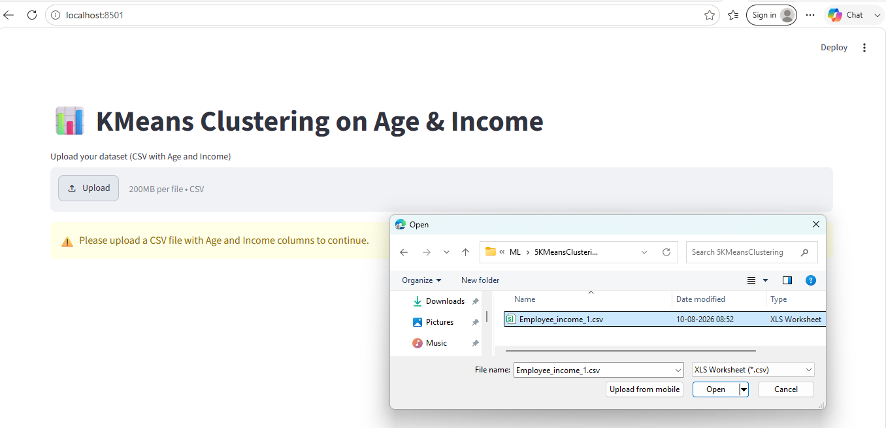
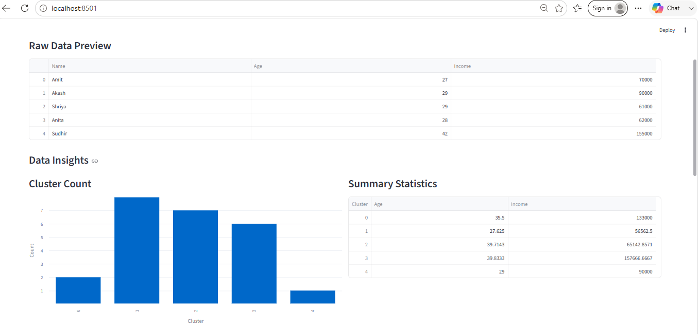
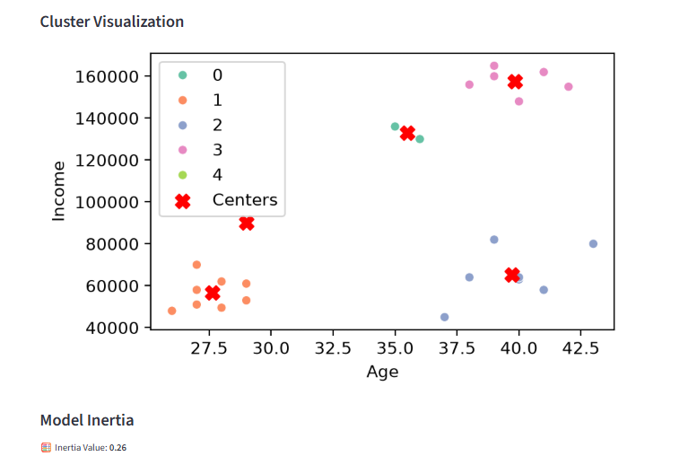
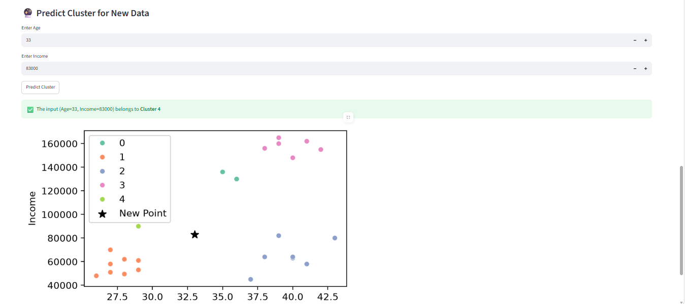

# KMeansClustering
This is a demo for KMeans clustering.

**Project Structure**

KMeansClustering/  
│  
├── kmeans_app.py  
├── kmeans.pkl  
├── scaler.pkl  
└── requirements.txt    

This Streamlit app would:  
  
1. Accept the employee Age and Income data in the form of csv from the user.
2. Show data insights.
3. Visualize cluster.
4. Show calculated model inertia based on the number of clusters.
5. Predict the cluster for entered Age and Income.

# Application Workflow

